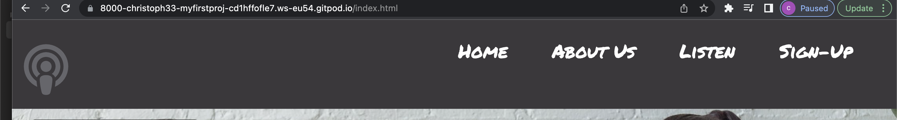

# The Podcast Project

# List of Contents

## User Experience UX
<li><a href=#idea>Project Purpose</a></li>
<li><a href="#user-stories">User Stories</a></li>
<li><a href="#target-audience">Target Audience</a></li>
<li><a href="#features">Features</a></li>
<li><a href="#future-features">Future Features</a></li>
<li><a href="#typography">Typography & Color Scheme</a></li>
<li><a href="design-structure">Design Structure</a></li>
<li><a href="#wire-frames">Wireframes</a></li>
 

# The Popdcast Project
The Podcast Project is an online plateform, where users can sign up for free and explore a world of podcasts. Before signing up, you can get a feel to what Podcasts are available with five sample Podcasts. 

---
# Features 
### Clickable Icon
- A clickable homepage logo, which will navigate you back to the top of the Home page, this is designed to give the user a simple but powerful way of getting back to the start of the webpage. This feature has become a common feature in most webapages in modern times. 
# Target Audience
The target audience is for anyone who’s inspired by the power listening, this could be for some who’s interests are culture, food, comedy, science , life lessons or wellness. Maybe theres a celebrity or singer that they want to know more about. As for ages groups, it’s towards all ages from 16 and above. Male or female.
---
# User Stories
- As a user, I want to be able to understand the basics of  the webpage just by viewing the Homepage. I want to see images that create more than just a picture, to help build the idea behind the webpage itself.

- When reading text, I want a short but brief paragraph, which is easy to follow and understand (Quick and simple)

- I want to be able to navigate easily thought the Links and pages, to find what I am interested in and to also navigate back to the Homepage simply.

-  To trying out the free sample podcasts, to get feel of what more can be offered if I was to sigh up.

- To be able to sigh up for free, to understand the form layout and have conformation that I have signed up correctly
---

### Nav-Bar
- Four clickable navigation links (Navagation menu) at the top of all pages. These are intended to navagate the user beyond the Home page and to explore more content that they would like to visit. “(Home About Us, Listen, Sign Up.
### Home-page images and links

- Below the header there are two images and two clickable links under each image. This will navigate the user to the listen page, in which they can view more content. By navagating the user to the listen page, it will push the user to explore more, within the listen page it's self.  
---

# Future Features 

- Sign-up and explore the full webpage. 
 
- Sign-Up and create your own profile.

- Get access to all podcasts and topics.

- Get access to extra features
---
# Typography 
- 

