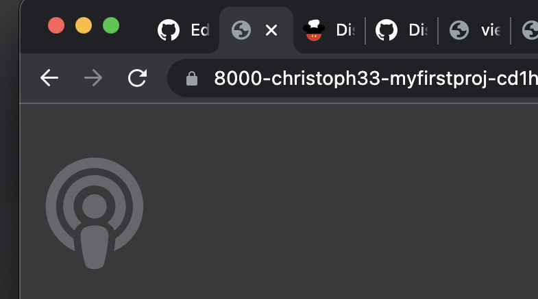
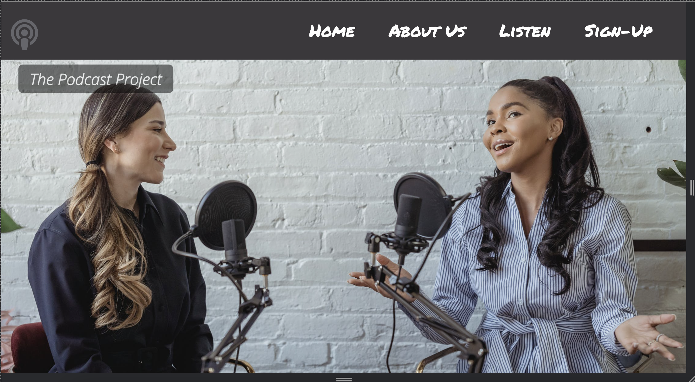
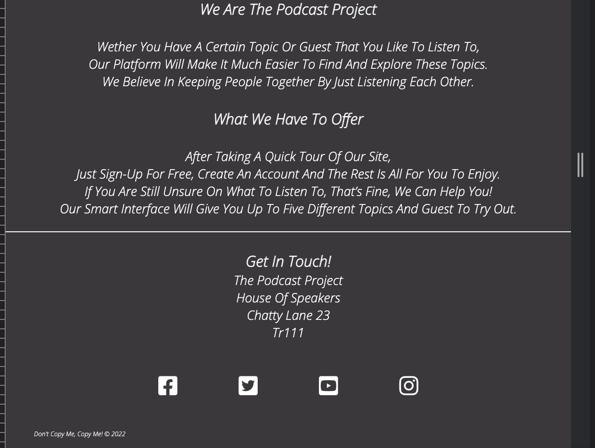
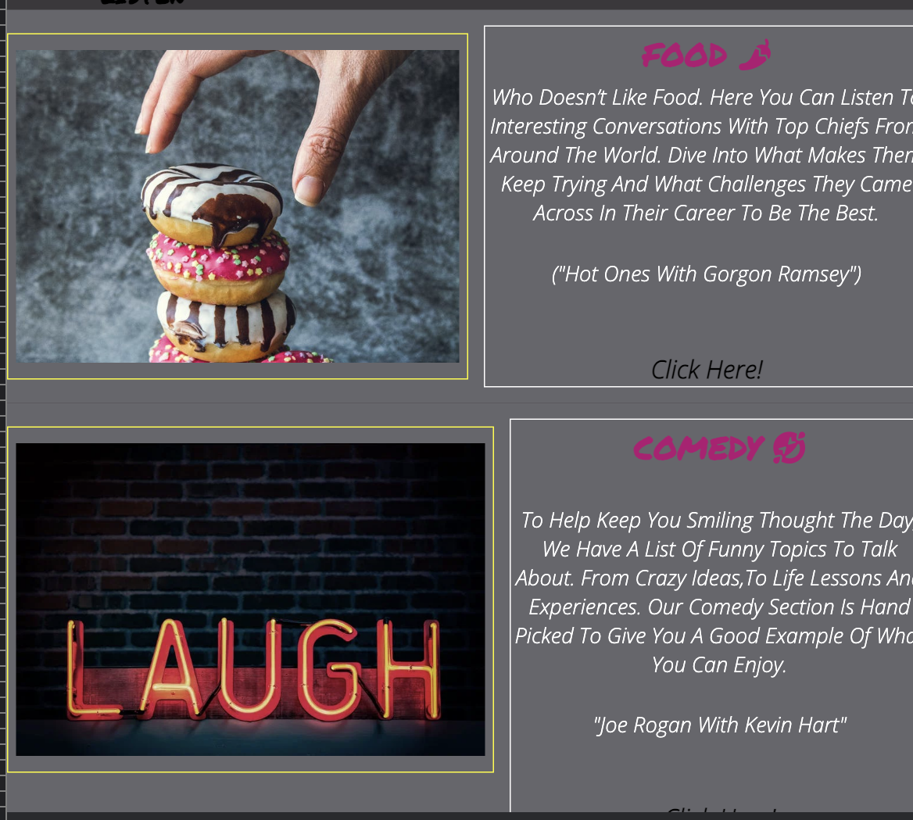

# The Podcast Project

# List of Contents
<li><a href="#home-page">Project Purpose</a></li>
<li><a href="#user-stories">User Stories</a></li>
<li><a href="#target-audience">Target Audience</a></li>
<li><a href="#future-features">Future Features</a></li>
<li><a href="#typography">Typography & Color Scheme</a></li>
<li><a href="design-structure">Design Structure</a></li>
<li><a href="#wire-frames">Wireframes</a></li>

---
 

# Features 
<li><a href="#home-page">Home Page</a></li>
<li><a href="#icon">Icon</a></li>
<li><a href="#nav-bar">Nav Bar</a></li>
<li><a href="#home-page">Home Page</a></li>
<li><a href="#main-content">Main Content</a></li>
<li><a href="#footer">Footer</a></li>
<li><a href="#about">About Us</a></li>
<li><a href="#listen">Listen</a></li>
<li><a href="#sign-up">Sign Up</a></li>
<li><a href="#future-features">Future Features</a></li>

---
 

# Technologies 
<li><a href="#testing">Testing</a></li>
<li><a href="#browser-tests">Browser Tests</a></li>
<li><a href="#responsive-design">Responsive Design</a></li>
<li><a href="#light-house-tests">Lighthouse tests</a></li>

---
### Home Page
The Podcast Project is created to get users interested in listening to Podcasts. This is where users can explore the site and choose five sample podcasts of differet topics before signing up. 

The goal behind the idea, is to get users to sign up for free, this will give them full access to more. 

---
---
# User Stories
- As a user, I want to be able to understand the basics of  the webpage just by viewing the Homepage. I want to see images that create more than just a picture, to help build the idea behind the webpage itself.

- When reading text, I want a short but brief paragraph, which is easy to follow and understand (Quick and simple)

- I want to be able to navigate easily thought the Links and pages, to find what I am interested in and to also navigate back to the Homepage simply.

-  To trying out the free sample podcasts, to get feel of what more can be offered if I was to sigh up.

- To be able to sigh up for free, to understand the form layout and have conformation that I have signed up correctly
---

# Features 

### Icon
- A clickable homepage logo, which is fixed at the top left of all pages. The Icon is clickable and will navigate the user back to the top of the Home page. This is designed to give the user a simple but powerful way of getting back to the start of tthe Home page. The clickable icon has become part of modern standards in most webiste, so by this feature, it keeps within modern designs along with other websites.

---

### Nav-Bar
- The Podcast project has four clickable navigation links (Navagation menu) at the top of all pages. These are intended to navagate the user beyond the Home page and to explore more conteent and pages that they would like to visit. These four pages consit of a Home page, an About us page, a Listen page and a Sign up page. The styling of these link within the Nav bar match that of the Footer. This is to add a symmetric design to the webpage. 

---

### Home-page
-

- The header section of the landing page (Homepage) has a Hero-image which covers a full width of 100% and 600px height. The image it self is inspired to show the user what the webpage is about, just by viewing the main image. An alternative text for the image, is placed for users who require a screen reader.

---

### Main Content
- This part of the main page invites the user to expolre more, by adding a short but brief piece of text, will encourage the user to go beyond the Home page and navigate to the section below.

- Below the header there are two images and two clickable links under each image. This will navigate the user to the listen page, in which they can view more content. By navagating the user to the listen page, it will push the user to explore more, within the listen page it's self. 

- For mobile screen sizes of a max-width 575px, the images and links are removed. This is to reduce the amount of information displayed on smaller sizes, as lots of content can be harder to read on this screen size. 

---

### Footer

- The Footer section contains three socail media links and a vidoe media link in whcih shares the as plateform as the sample videos withn the website.

- All four media links match the color scheme to the Nav bar in the header of the webpage. In keeping with the colors from Header to Footer, it will create symmetrical feel to the page.

- At the bottom of all pages, you will find a Copyright symbol and text.

---

### About 

- The About Us page gives the user a brief piece of information on the creators behind the idea. Who they are. It gives the User a trust worthy feel to who manages the website, before entering personal details and siging up

- Styling for the Header is copied from the main Home page, to give. a sense of symmetry and keeping the idea that the website is about listening 

- Below the about us section is the land address of the company, this is also shared to create trust with the website.

---

### Listen

- The Listen page is from where the user will find five Podcast samples to try by just clicking on a link under each explanation of topic. 

- The images (left) will give the user a visual way of knowing what type of topic this will cover. The image are also used to give color to the page. 

- A Brief piece of text (right) along side each image will explain to the user what this topc covers.

- A link description will be added above each clickable link, this gives the user the information as to what and who they will be listening to before clicking.

- In mobile screen sizes of a max-width 575px, the listen page will have a new layou, this is to be more user friendly when lookin at the images and text. 

---

### Sign Up 

- The sign up page is the final page to expore, this gives the user the opertunity to enter personal information and to sign up. 

- Personal details require - First name, last name, user name, password

- For design and styling, the Sign Up page uses a background image. This is intented to give the user an idea that this  is separate page from the other pages, but also by keeping the theme of the website. The use of a yellow border around the form is to hightligh the information more clearly over the background image. 

- Once the user has entered all information correctly, they will be navigated to a thank you page. This is to give conformation to the user that their personal detials have been sent.

---

# Future Features 

- Sign-up and explore the full webpage. 
 
- Sign-Up and create your own profile.

- Get full access to all podcasts and topics.

---

# Typography 

- All Font family styling was used with an open source - Google Fonts
https://fonts.google.com/

- Font family used to for H1 & H2 - Permanent Marker "regular 400"
https://fonts.google.com/specimen/Permanent+Marker?query=perm#standard-styles

- Default setting  - "sans serif"

- Font family used For H3, H4 & P -  Open Sans "light 300"
https://fonts.google.com/specimen/Open+Sans?query=open+

- Defaul setting - "sans serif"

- All Icons are taken from an open source - fontawsome
https://fontawesome.com/

---
# Colors 
---

- All colours a are picked using a complementary Shade setting with Adobe Color Wheel. Different shades of Grey are used to give a feeling of warmth throughout the site. This also reduces the brightness of the screen, to be more user friendly with people using contact lenses or glasses. 

- The color Pink is used to breakup some similarities for when needing to click on a link or to highlight an icon. Pink was also picked using adobe color wheel inline with the complementry shades of Grey.

- All colors are taken from an open source - Adobe Colour Wheel
https://color.adobe.com/create/color-wheel

- Background color for body - #3A383B "Dark Grey"
- Page tiles and section tiltes -#000000 "Black"
- Home icon - #66666B "medium grey"
- H3, H4 & Paragraphs - #fff "White"
- H2 Icons - #B50273 "Pink"
- text borders - #000000 "Balck"
- Image borders - #D9D2D7 "light grey"

---
# Content

- Content was taken from Spring Cast  then conscripted in my own words.
https://springcast.fm/podcast-website/

# Media

- Images where used from an open source - Pixels
https://www.pexels.com/nl-nl/

# Target Audience
- The target audience is for anyone who’s inspired by the power listening, this could be for some who’s interests are culture, food, comedy, science , life lessons or wellness. Maybe theres a celebrity or singer that they want to know more about. As for ages groups, it’s towards all ages from 16 and above. Male or female.
---

# Wire frames 

- An open source was used to design this website - Balsamiq Wireframes:
https://balsamiq.com/learn/articles/what-are-wireframes/

---

---

---

# Technologies

### Testing
- The Podcast Project has had all html and css markup tested using The W3 css validtor service https://jigsaw.w3.org/css-validator/validator#warnings website. This is enusure all markup is working effectively throughout each web page.

- Css validtion tests

- Home page validtion tests

- About us page validtion tests

- Listen page validation 

- Sign up page 

___

### Browser Tests
 The Podcast Project has been tested on to two browser 
 - Google Chrome 
 -Safari 

 ---

### Responsive Design 

- The Podcast Project has been tested with it's responsiveness in four screen sizes and devices. These devices are, iphone SE, ipad mini, a latop screen size if 1200px and in a browser screen size. 
The use of developer tools in Google Chrome where used in the creating and testing of the webistes responsiveness, along with the help of I Am Responsive https://ui.dev/amiresponsive?url=https://christoph33one.github.io/my-first-project/index.html. 

### Light House tests
The Podcast project was tested on Preformance, accessibility, best practice and SEO through all four pages. 

- Home Page

- About Us page 

- listen page 

- Sign Up Page 

### Debugging

- When Building my webpage from a mobile screen to start witjh, I had issues to conten not following its default postions when increasing the screen size to tabelt or browser size. I soon realised that this was going get me to rewrite a lot of css when writing the mark up for media quires. I decided to create my html mark up in browser size first and then add media quires to a small er screeen size. This was an effective method. 

- My first experience with bugs was when adding links to my nav Bar. I had issues using the Ancore tag with a href attribute. Once creating a new page in my file paths, I could not get the two pages link via the Nav bar. My solution was to look back over the Love Running project, to see how the anchor tag worked. From there I added my my own markup and fixed the issue.

- When validating my css mark up, I had erros as to using a % value for letter-spacing. To clear the error, I changed the value tp px.

- When validating my html mark up, an error flagged up (header open). The issue was that I had wrapped a h1 elment around an icon. I believed wrapping an icon in a h1 would be the best practice for styling purposes. 
I researched using W3schools https://www.w3schools.com/ to get an understaning to styling icons in css. To solve this error, I removed the h1 element and left it in it's original anchor tag.

- 

